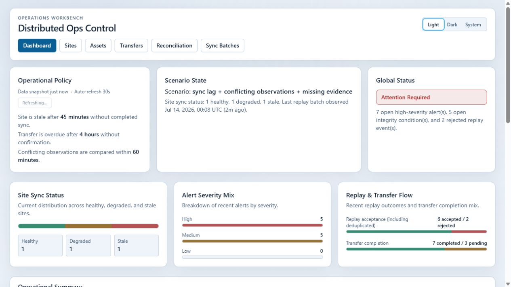
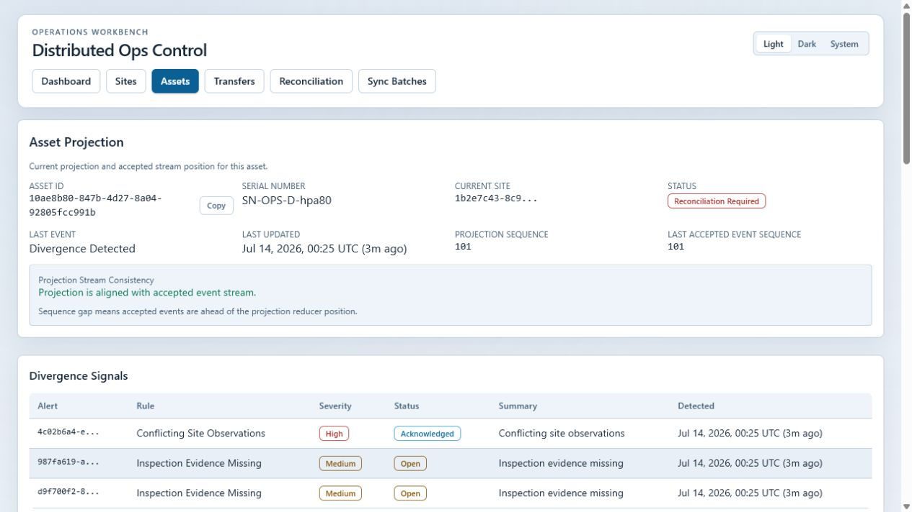
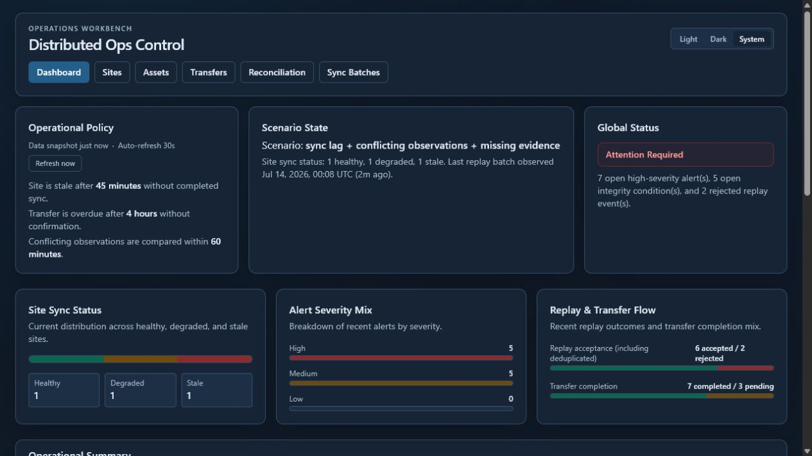
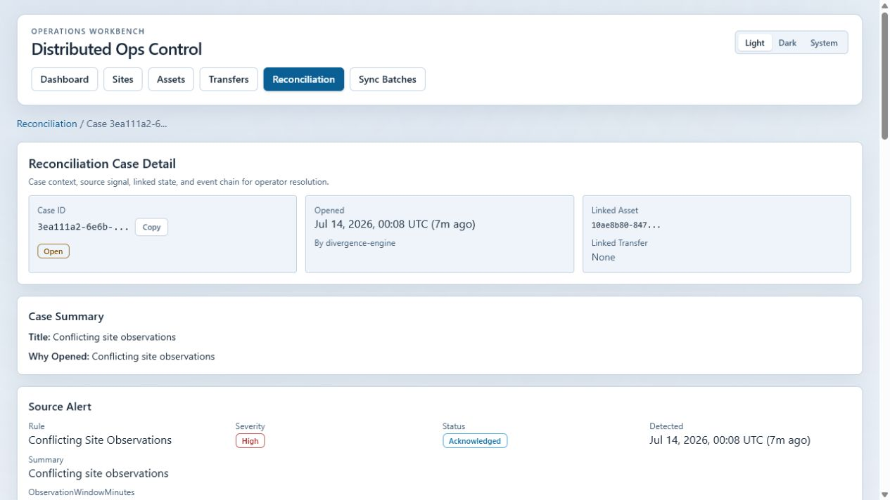

# Distributed Ops Control Platform

A clean-room reference implementation showing how multi-site operations detect, explain, and resolve drift between accepted history and current operating state.

The system models sites that can work independently, reconnect later, replay queued events, and disagree about asset location, transfer status, evidence, or projected state. It turns those disagreements into explicit operator work instead of hiding them in mutable records.

[Mike Holton's portfolio](https://haldn.com/mike) | [GitHub profile](https://github.com/mholton-ops) | [Hardening audit](docs/hardening-audit-2026-07-13.md) | [Safety boundaries](docs/non-goals-and-safety-boundaries.md)

## Why This Matters

Distributed operations rarely fail as one obvious outage. They drift:

- A site works offline and syncs later.
- A transfer is physically complete but not confirmed.
- Two locations report conflicting observations.
- Required evidence is missing.
- A projection falls behind accepted events.
- A replay sends the same source event more than once.

This platform preserves accepted history, derives current state deterministically, detects disagreement, and gives an operator a traceable path to resolution.

## What Reviewers Can Verify

| Engineering concern | Visible proof |
| --- | --- |
| Immutable operating history | Append-only event log with normalized event inspection |
| Current-state performance | Deterministic asset projections derived from accepted events |
| Offline and delayed sync | Replay batches with accepted, rejected, and deduplicated outcomes |
| Idempotency | Source-site identity plus a canonical event hash deduplicates exact retries and rejects key reuse with different content |
| Drift detection | Rules for stale sites, missing evidence, overdue transfers, conflicting observations, and projection lag |
| Human control | Alerts become versioned reconciliation cases with event-backed, concurrency-safe resolution |
| Traceability | Asset, transfer, sync, inspection, alert, and case views remain linked |
| Test access boundary | Versioned API routes require a server-held bearer token; browser mutations stay same-origin |

## Operator Workbench Screenshots

The captured workbench uses deterministic synthetic test data on the loopback-only stack. Click an image for the full-size view, or browse the [complete desktop, dark-mode, detail, and mobile gallery](docs/images/README.md).

| Operational dashboard | Asset investigation |
| --- | --- |
|  |  |

| Dark-mode dashboard | Reconciliation case |
| --- | --- |
|  |  |

Responsive captures are available for the [dashboard](docs/images/dashboard-mobile-view.jpg), [asset inventory](docs/images/assets-mobile-view.jpg), and [reconciliation workbench](docs/images/reconciliation-mobile-view.jpg). The gallery also includes the [asset inventory](docs/images/assets-view.jpg), [reconciliation overview](docs/images/reconciliation-view.jpg), and [sync replay diagnostics](docs/images/sync-batch-detail-view.jpg).

## Architecture at a Glance

~~~mermaid
flowchart LR
  Sites[Distributed Sites] -->|events and replay| API[Fastify API]
  API --> Log[(Append-Only Event Log)]
  API --> Project[Deterministic Projection]
  Project --> State[(Asset Projection)]
  Log --> Scan[Divergence Scanner]
  State --> Scan
  Scan --> Alerts[Alerts]
  Alerts --> Cases[Reconciliation Cases]
  Workbench[Operator Workbench] --> API
  Cases -->|controlled resolution| API
~~~

## Review in 5 Minutes

1. Open the dashboard and inspect system health, policy thresholds, and scenario state.
2. Open an asset detail page and compare projected state with accepted event sequence.
3. Open a reconciliation case to inspect its source alert, linked entities, evidence, and resolution writeback.
4. Open a sync batch to inspect accepted, rejected, and deduplicated replay results.
5. Run the tests that cover replay idempotency, projection correctness, stale-site detection, evidence gaps, and reconciliation.

## Seeded Demonstration Scenario

The deterministic seed creates a mixed operating state:

1. Twelve assets are registered across three sites.
2. Eleven transfers are created; three remain unconfirmed beyond policy threshold.
3. Conflicting site observations generate alerts.
4. Two inspections intentionally lack evidence metadata.
5. A replay batch includes a duplicate source event to demonstrate idempotent handling.
6. One site remains stale beyond threshold.
7. One projection is intentionally placed behind the accepted stream.
8. A divergence scan opens reconciliation cases for high-severity findings.

The scenario is deliberately inspectable and repeatable. It is not random demo data.

## Core Model

- **Accepted event**: immutable source-of-truth record
- **Projection**: derived current-state view for fast operational reads
- **Alert**: explainable rule output showing where state and policy disagree
- **Reconciliation case**: operator-owned investigation and closure record
- **Sync batch**: replay envelope with accepted, rejected, and deduplicated outcomes

Supported event flows include asset registration and movement, transfer initiation and completion, inspection and evidence, site sync, divergence detection, and reconciliation.

See [Architecture](docs/architecture.md), [Domain Model](docs/domain-model.md), and [Event Model](docs/event-model.md).

## Technical Implementation

- TypeScript monorepo
- Fastify API
- PostgreSQL with Drizzle migrations
- Next.js operator workbench
- Shared Zod contracts
- Deterministic projection and divergence packages
- Replay and delay simulator
- Seeded scenarios plus unit and end-to-end tests
- Node.js 24 with a locked npm toolchain

## Run the Test Stack

Prerequisites:

- Docker and Docker Compose
- Node.js 24 and npm 11 for host-side checks
- Distinct `POSTGRES_ADMIN_PASSWORD` and `OPS_TEST_DB_PASSWORD` values of at least 24 characters supplied to the current process through approved secret plumbing
- An explicit non-secret `OPS_TEST_ACTOR` audit label

The supported stack is local testing only. PostgreSQL, API, and web ports publish to `127.0.0.1`; no public or IIS deployment is included. The bootstrap script generates a runtime-only API test token when one is not already supplied. It never prints the token or either database password.

The image bootstrap administrator is separate from the `ops_test` app/migration role. `ops_test` is restricted from superuser, database creation, role creation, replication, row-security bypass, database-level object creation, and inherited role memberships. Runtime and migration preflights fail closed unless that exact role boundary and the canonical `ops_control_test` target are present. The workbench accepts only the canonical loopback browser origin and forwards its server-held bearer only to the allowlisted loopback/Compose API target. Override `OPS_TEST_WEB_ORIGIN` only when intentionally using a different loopback web port.

From PowerShell, after populating both database passwords in the current process:

~~~powershell
$env:OPS_TEST_ACTOR = "local-test-operator"
.\bootstrap-local.ps1 -Build -SeedDemoData -ConfirmDatabase ops_control_test
~~~

Endpoints:

- Operator workbench: `http://127.0.0.1:3000`
- API liveness: `http://127.0.0.1:4000/health`
- API readiness: `http://127.0.0.1:4000/ready`
- Authenticated dashboard API: `http://127.0.0.1:4000/api/v1/dashboard`

Stop the stack without deleting the database volume:

~~~powershell
.\bootstrap-local.ps1 -Stop
~~~

Resetting test data is destructive and requires the exact database confirmation:

~~~powershell
.\bootstrap-local.ps1 -ResetTestData -ConfirmDatabase ops_control_test
~~~

The named PostgreSQL volume survives normal service restarts. Reuse the same two vault-backed database passwords while that volume exists, or explicitly reset the test volume. A volume created before the split-role boundary must be reset with the confirmed `-ResetTestData` workflow; the health and migration checks intentionally reject the former superuser-style `ops_test` role.

Confirmed demo seeding is intentionally destructive inside `ops_control_test`: it clears and rebuilds the synthetic domain tables while preserving migration history. Do not point the guarded seed command at retained or non-test data.

Run the simulator:

The simulator must use the same caller-supplied `OPS_TEST_AUTH_TOKEN` as the API. Load a value of at least 32 characters from approved secret plumbing before starting the stack; a token generated automatically by the bootstrap is intentionally discarded from the caller's shell and cannot be reused by the simulator.

~~~powershell
.\scripts\run-simulator.ps1 -Scenario healthy-movement
~~~

The simulator requires `OPS_TEST_AUTH_TOKEN` in its server process and defaults to the loopback API. It never receives the token through browser-visible configuration.

Available deterministic scenarios:

~~~powershell
$env:SIM_SCENARIO = "healthy-movement"
npm run start --workspace apps/simulator

$env:SIM_SCENARIO = "sync-lag-divergence"
npm run start --workspace apps/simulator
~~~

Scenario identities and timestamps are stable within a 30-minute run bucket: an immediate rerun is an exact idempotent retry, while later buckets remain inside the live divergence window without reusing old payload identities. `healthy-movement` completes a transfer with inspection evidence. `sync-lag-divergence` deliberately creates a partial replay, a stale-site condition, and conflicting current-window observations, then fails the run if the expected dual-site alert is absent.

## Verification

The main verification gate performs a clean topological build, lint, every workspace typecheck, domain and API tests, and a compiled production-start smoke:

~~~bash
npm ci --no-audit --no-fund
npm run verify
npm run audit
~~~

With the guarded PostgreSQL test database migrated and seeded, the browser suite exercises real persistence, same-origin mutations, 390px overflow, navigation state, and automated WCAG A/AA checks:

Populate `DATABASE_URL`, `OPS_TEST_AUTH_TOKEN`, and `OPS_TEST_ACTOR` in the current process through approved runtime secret plumbing, then run the complete host-side database/browser sequence from PowerShell:

~~~powershell
npm run build
npm run db:migrate
$env:OPS_RUN_DB_INTEGRATION = "1"
npm run test:integration
Remove-Item Env:OPS_RUN_DB_INTEGRATION
$env:OPS_ALLOW_DEMO_SEED = "ops_control_test"
npm run db:seed
Remove-Item Env:OPS_ALLOW_DEMO_SEED
npm run test:e2e
~~~

CI additionally starts the composed non-root runtime images, waits for database-backed readiness, and checks both the loopback UI and an authenticated API request. See [Test Security Model](docs/test-security-model.md) and [API Reference](docs/api-reference.md) for the exact boundary.

High-value tests cover:

- replay idempotency
- replay payload-key conflicts and durable per-event outcomes
- projection update correctness
- transactional rollback and same-asset concurrency ordering
- stale-site detection
- overdue transfer confirmation
- inspection evidence gaps
- reconciliation version conflicts and resolution events
- API authentication and database readiness

## Repository Map

~~~text
apps/
  api/                 Fastify API and database access
  web/                 Next.js operator workbench
  simulator/           Deterministic replay and delay scenarios
packages/
  contracts/           Shared typed contracts and schemas
  domain/              Projection and divergence logic
  config/              Shared TypeScript configuration
  ui/                  Shared UI helpers
docs/
  architecture.md
  domain-model.md
  event-model.md
  hardening-audit-2026-07-13.md
  test-security-model.md
  non-goals-and-safety-boundaries.md
~~~

## Deep Review Path

1. Inspect [event ingestion and side effects](apps/api/src/domain/event-service.ts).
2. Inspect [operator-facing aggregation](apps/api/src/domain/query-service.ts).
3. Inspect [projection logic](packages/domain/src/projection.ts).
4. Inspect [divergence rules](packages/domain/src/divergence.ts).
5. Review asset, transfer, sync, reconciliation, and site detail pages.
6. Run the deterministic seed and test suite.

## Design Decisions

- **Append-only history plus derived projections** preserves auditability and replay semantics.
- **Rule-based divergence detection** keeps exceptions explainable to operators.
- **Explicit reconciliation workflows** make ownership and resolution visible.
- **A single relational database** keeps the public reference deterministic while still modeling multi-site drift.
- **Operator-focused interfaces** prioritize investigation and control over decorative dashboards.

## Public-Safe, Test-Only Boundary

This repository is original and public-safe. It intentionally omits proprietary schemas, customer data, protected workflow details, production identity/authorization, binary evidence storage, private infrastructure, and private integrations.

It demonstrates the control pattern and implementation depth without claiming to be a production deployment. Runtime credentials are never committed, and the supported host listeners are loopback-only.
