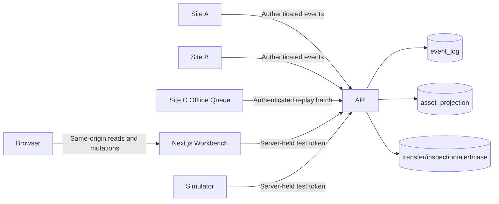
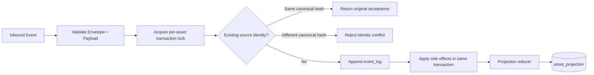
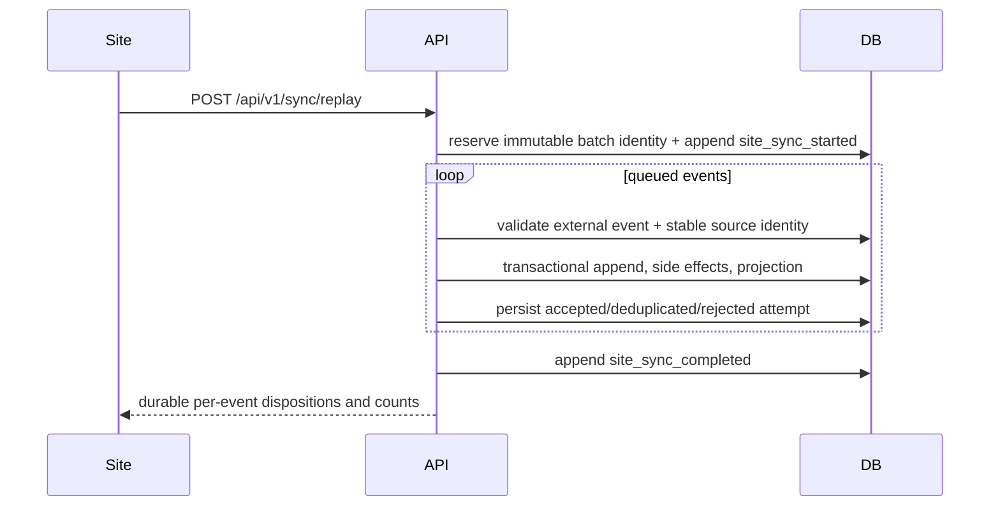
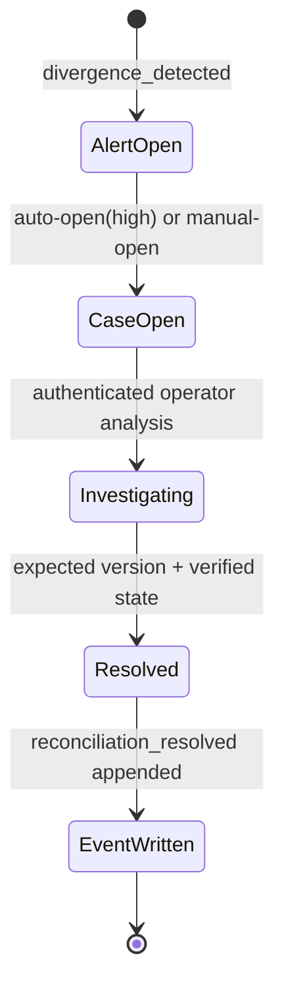

# Architecture

## System Context

The platform provides centralized operational control for serialized assets across multiple sites. Sites can operate independently for short periods, queue events when offline, and later replay events through sync batches.

## High-Level Components

- API (`apps/api`): event ingestion, projection updates, divergence scan, reconciliation workflows
- Database (PostgreSQL): source of truth and projections
- Workbench UI (`apps/web`): operator dashboard and investigation surfaces
- Simulator (`apps/simulator`): deterministic offline/online scenario runner

## Runtime Topology

The supported host topology is test-only. PostgreSQL, API, and web ports publish to loopback. Containers listen on their isolated Compose network only where service-to-service reachability requires it.

## Event Ingestion and Projection Flow

The append, side effects, and projection update commit or roll back together. The per-asset transaction lock keeps ledger order and reducer order aligned under concurrent writes; the projection write also refuses to replace a newer sequence.

## Sync Replay Flow

Reusing a completed batch ID with identical content returns the persisted outcome. Reusing it with different content is a conflict, and a concurrent worker receives an in-progress conflict instead of processing the same batch twice.

## Reconciliation Lifecycle

Resolution uses optimistic version checking inside the write transaction. Browser-provided actor names are not accepted; the API records its configured test actor.

## Internal API Architecture

- Route layer: test-token authorization, versioned endpoints, request validation, and bounded responses
- Domain services: event ingestion, replay, divergence scanning, query aggregation
- DB layer: Drizzle schema + SQL migration management
- Workbench BFF: canonical loopback origin validation, allowlisted upstream API target, and server-only token forwarding

## Key Flows

1. Event Ingestion:
- validate request against event-specific schema
- deduplicate by `(site_id, source_site_event_id)`
- append to `event_log`
- apply side effects (transfer, inspection, evidence, sync)
- update `asset_projection`

2. Sync Replay:
- emit `site_sync_started`
- replay queued events idempotently
- emit `site_sync_completed`
- update site sync timestamp and batch counts

3. Divergence Scan:
- evaluate generic divergence rules against operational tables
- create alerts for new findings
- auto-open reconciliation cases for high severity findings

## Operational Qualities

- append-only ledger for auditability
- deterministic projection updates
- transactional writes with rollback on side-effect or projection failure
- payload-aware idempotency using source identity plus canonical SHA-256 hash
- immutable replay batch identity and durable per-event dispositions
- explicit rule-based divergence detection
- alert fingerprints, acknowledgement/resolution lifecycle, and recurrence counts
- optimistic reconciliation concurrency control
- database-backed readiness and graceful shutdown
- separate PostgreSQL bootstrap administration plus a cluster-restricted app/migration role with fail-closed privilege checks
- workbench readiness that includes a bounded upstream API/database probe

## Non-Goals

- Not a production authorization or tenancy model.
- Not a full distributed infrastructure deployment topology.
- Not a clone of any protected internal architecture.
- Not supported on a public or non-loopback listener.

See [Test Security Model](test-security-model.md) for the runtime boundary.
