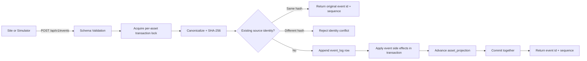
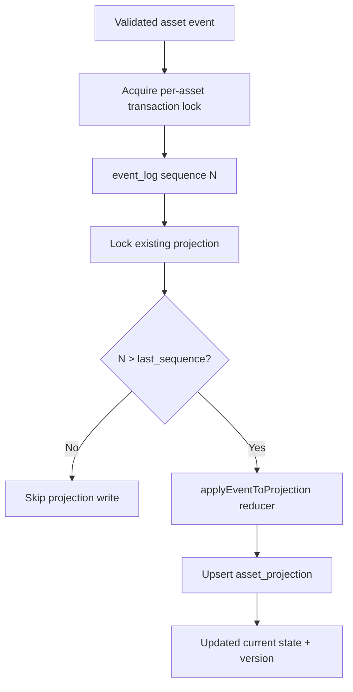

# Event Model

## Event Principles

- Event names are explicit, stable, and lowercase snake_case.
- Event log is append-only.
- Event handlers are deterministic.
- Accepted-event append, domain side effects, and projection advancement are one transaction.
- Replay identity combines a stable source key with a canonical event hash.
- Internal lifecycle events cannot be submitted through external event or replay routes.

## Supported Events

- `asset_registered`
- `asset_moved`
- `asset_received`
- `inspection_recorded`
- `evidence_attached`
- `transfer_initiated`
- `transfer_completed`
- `site_sync_started`
- `site_sync_completed`
- `divergence_detected`
- `divergence_cleared`
- `reconciliation_opened`
- `reconciliation_resolved`

## Event Envelope

Each event includes:

- `eventType`
- `assetId` (nullable for system events)
- `siteId`
- `transferOrderId` (nullable)
- `occurredAt`
- `sourceSiteEventId` (required for external operating events; nullable for server-owned lifecycle events)
- `payload` (validated by per-type schema)

Event-specific schemas are strict and enforce cross-field relationships such as transfer ID agreement, origin/destination consistency, site ownership, field sizes, SHA-256 shape, and bounded future clock skew.

## Event Flow Diagram

## Idempotency Model

1. Canonical JSON is built from the validated envelope and payload with stable object-key ordering.
2. The API stores its SHA-256 hash in `event_log.event_hash`.
3. `(site_id, source_site_event_id)` remains the database uniqueness boundary.
4. If the key exists with the same hash, return the original event ID and sequence without repeating side effects.
5. If the key exists with a different hash, return `IDEMPOTENCY_PAYLOAD_CONFLICT`.
6. Replay additionally binds `sync_batch.id` to the complete canonical request hash and stores every queued event disposition.
7. Reusing an asset, transfer, inspection, or evidence business identifier under a different source identity is rejected; it cannot append a second event that rewinds projection state.

## Projection Update Model

`asset_projection` applies deterministic state transitions based on event type:

- register/receive/transfer completion => `at_site`
- movement/initiation => `in_transit`
- inspection requiring review => `under_inspection`; pass/fail observations retain `at_site`
- divergence => `reconciliation_required`
- reconciliation resolution => the explicitly verified non-divergent asset state

## Projection Flow Diagram

## Handler Testability

Domain rule modules and projection reducers are isolated for unit tests under `packages/domain/src/*.test.ts`. PostgreSQL-backed integration tests cover atomic rollback, duplicate/conflicting identity, replay outcomes, and concurrent ordering.

## Non-Goals

- Not a generalized workflow engine for arbitrary event types.
- Not exactly-once delivery infrastructure.
- Not a copy of any confidential event contract set.
