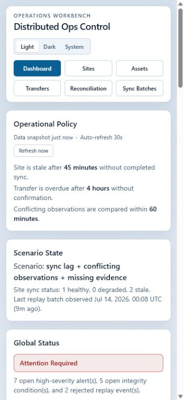
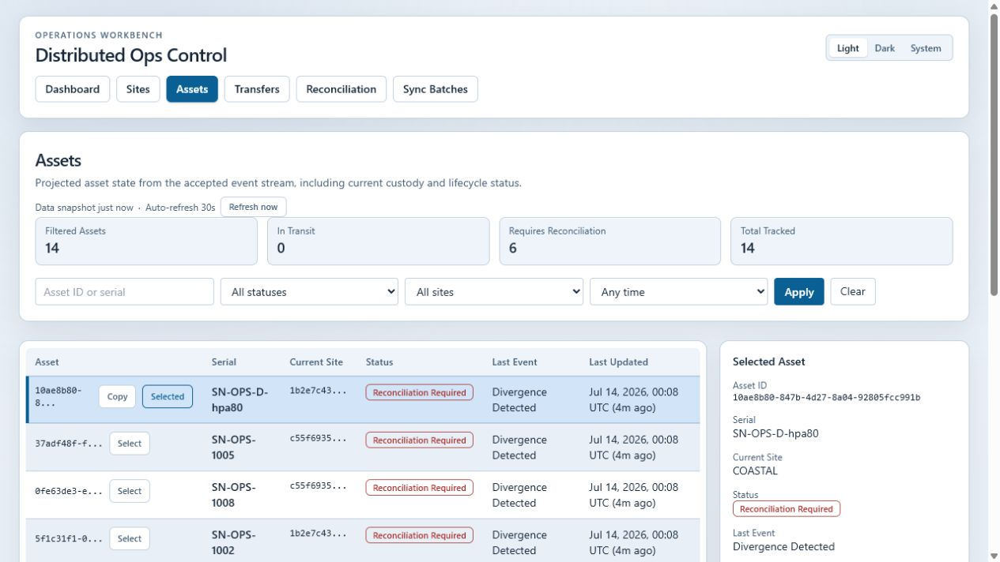
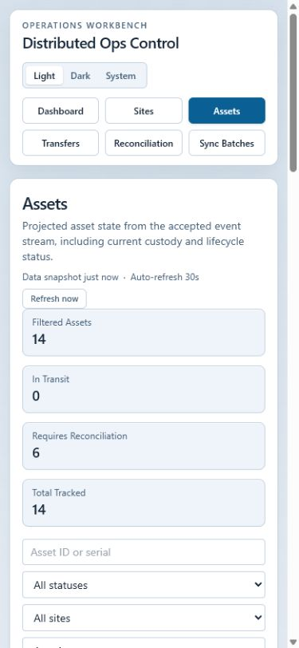
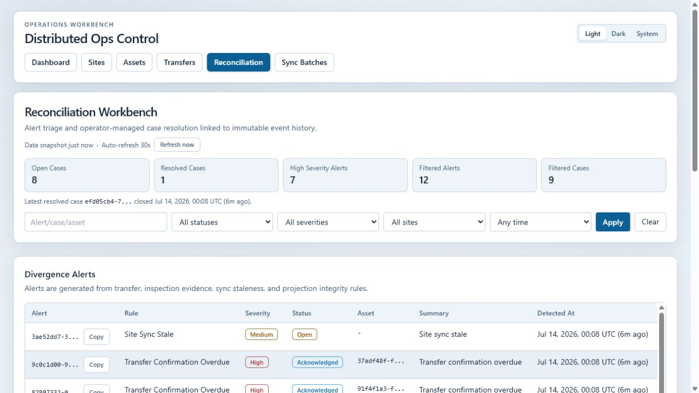
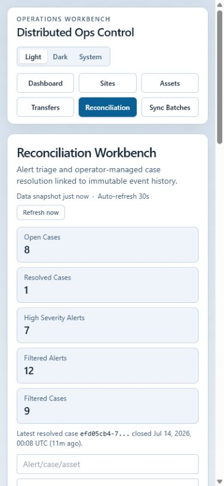
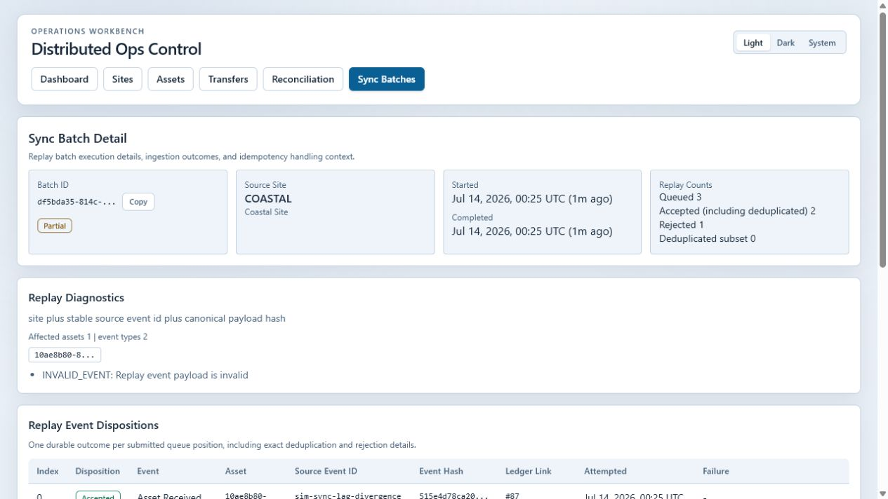

# Screenshot Gallery

These repository-safe screenshots show the loopback-only operator workbench running against deterministic synthetic test data. Click any image to open the full-size capture.

## Dashboard

| Light desktop | Dark desktop |
| --- | --- |
|  |  |

## Asset Investigation

| Asset inventory and filters | Asset projection and divergence detail |
| --- | --- |
|  |  |

## Reconciliation

| Reconciliation workbench | Reconciliation case detail |
| --- | --- |
|  |  |

## Replay Diagnostics

All identifiers, timestamps, serials, sites, alerts, and replay outcomes shown here belong to the synthetic test scenario. Do not include real system screenshots or customer data.
