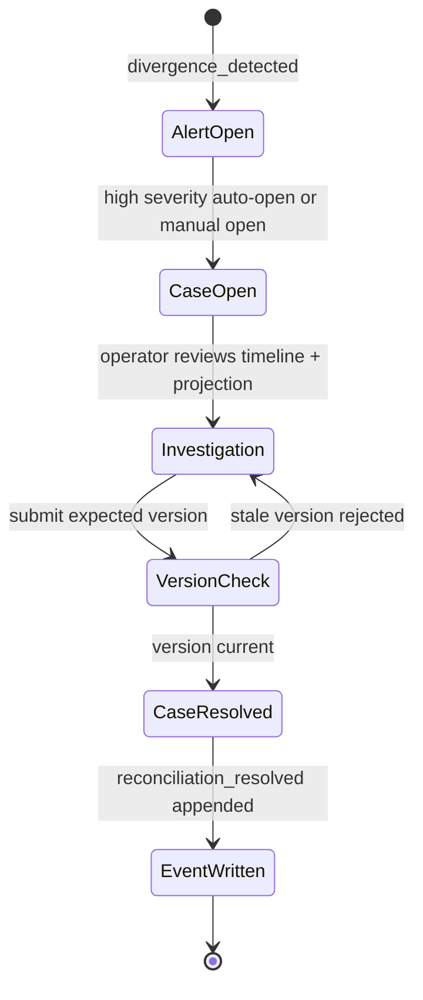

# Reconciliation

## Purpose

Reconciliation handles operational exceptions detected automatically or opened manually.

## Inputs

- divergence alerts from rule scanner
- operator-raised manual cases

## Divergence Rules

- `TRANSFER_NOT_CONFIRMED`: transfer remains in `initiated` status past `TRANSFER_CONFIRMATION_HOURS`.
- `ASSET_OBSERVED_AT_MULTIPLE_SITES`: latest observation stream shows an asset associated with more than one site.
- `INSPECTION_MISSING_EVIDENCE`: inspection exists with zero linked `evidence_metadata` records.
- `SITE_PROJECTION_STALE`: site has no sync completion or exceeds `SYNC_STALE_MINUTES` since last completion.
- `PROJECTION_SEQUENCE_BEHIND_EVENT_STREAM`: `asset_projection.last_sequence` lags latest event sequence for the asset.

## Case Lifecycle

- `open`: case created and awaiting investigation
- `resolved`: action complete with resolution summary

Each case carries an integer version. Resolution must submit the version that the operator reviewed; a stale version is rejected instead of overwriting newer work.

## Workflow

1. Divergence scan upserts alerts by a stable fingerprint and appends a detection event.
2. Repeated detections increment occurrence metadata without creating duplicate open cases.
3. High-severity alerts auto-open one reconciliation case; opening a case acknowledges its source alert.
4. Operators can open additional site-scoped cases manually.
5. Operators resolve cases with an explicit summary, the reviewed case version, and a verified asset state when the case is asset-linked.
6. The API derives the actor from its configured test identity and appends `reconciliation_resolved` in the same transaction as the case plus any applicable linked alert and asset projection updates.
7. A later recurrence can reopen a resolved alert while preserving the earlier case history.
8. When a managed scan condition disappears, the scanner appends `divergence_cleared` and resolves its alert only if no open reconciliation case still owns that condition.

## Reconciliation Lifecycle Diagram

## Alert vs Case vs Projection vs Event

- **Alert**: machine-detected divergence signal, fingerprinted by rule code and affected asset/site identity.
- **Case**: operator-owned investigation record tied to an alert or manual concern.
- **Projection**: current derived state for fast operations, not the source of truth.
- **Accepted event**: immutable record in `event_log` that drives side effects and projection.

## UI Surfaces

- list alerts by severity and rule code
- list open/resolved cases
- create manual reconciliation case
- resolve an asset-linked case with verified state and concurrency check
- show mutation success, validation, configuration, and stale-version feedback

## Operational Rules

- Cases are auditable and timestamped.
- Case resolution never deletes source alerts/events.
- Event timeline remains immutable.
- Browser clients cannot choose the recorded actor.
- Manual cases require an explicit valid responsible site; the API never assigns an arbitrary first site.
- Alert acknowledgement is preserved across repeated scans while its case remains open.
- Resolved alerts may reopen when the same fingerprint is detected again.

## Non-Goals

- Not a full case-management platform with escalation trees.
- Not a complete human workflow/approval engine.
- Not a reconstruction of protected operator playbooks.
