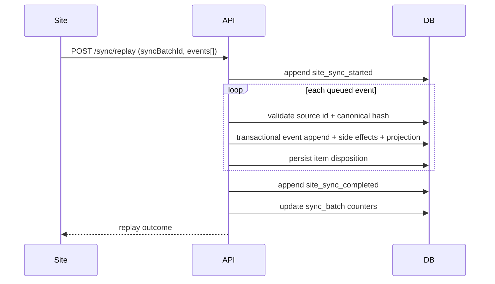

# Sync and Replay

## Operational Context

Sites can go offline and continue recording local events. When connection restores, queued events are replayed through a sync batch.

## Replay Flow

1. Site sends `/api/v1/sync/replay` with `siteId`, `syncBatchId`, and queued events.
2. API reserves the batch ID against a canonical request hash and emits `site_sync_started`.
3. API validates that every replay item is an external event for the envelope site and has a stable source event ID.
4. Each item is ingested transactionally and receives a durable accepted, deduplicated, or rejected attempt record.
5. API emits `site_sync_completed` with accepted, rejected, and deduplicated counts.
6. `sync_batch` and site sync timestamps are updated. A partial or failed replay does not claim a successful site sync.

## Determinism

- Replay order is preserved by request list order.
- An exact retry of `(siteId, sourceSiteEventId)` returns the original event identity without repeating side effects.
- Reusing that identity with different canonical event content returns an idempotency conflict.
- Reusing a completed `syncBatchId` with the same request returns its persisted result; different content returns a batch conflict.
- A concurrent worker cannot process the same batch while it is in progress.
- Per-asset transaction locking keeps accepted ledger order and projection reducer order aligned.

## Lag Visibility

Site lag is surfaced by comparing `site.last_sync_completed_at` against configured staleness threshold (`SYNC_STALE_MINUTES`).

The test simulator uses run-bucket-scoped identities and timestamps. Repeating a scenario inside the same 30-minute bucket exercises exact replay idempotency; a later bucket receives new identities so its observations stay meaningful to rolling-window rules. The drift scenario asserts a partial replay and the expected dual-site divergence instead of treating request success alone as proof of the scenario outcome.

## Sequence Diagram

## Replay Outcome Model

- `queued_event_count`: events submitted by the site.
- `accepted_event_count`: events accepted into processing, including exact deduplicated retries.
- `rejected_event_count`: events rejected due to validation or side-effect failures.
- `deduplicated_event_count`: accepted events that matched an existing `(site_id, source_site_event_id)`.

Each queued index also stores its source ID, canonical event hash, disposition, linked accepted event ID, and a bounded safe error code/message when rejected. These values are visible in `sync_batch` detail and remain available when a completed batch is retried.

## Failure Semantics

An accepted item commits its ledger row, domain side effects, and projection together. If any one of those writes fails, that item transaction rolls back and a rejected attempt is recorded separately. Other valid items in the same replay may still succeed, producing a `partial` batch.

A process interruption can leave a batch marked `processing`. The safe behavior is to reject another worker rather than guess whether the abandoned worker still owns the batch. Because this is a test platform, recovery is an explicit test-data reset; a production design would need leases and a supervised resume workflow.

## Non-Goals

- Not a production message bus or distributed log implementation.
- Not guaranteed real-time synchronization across all sites.
- Not a proprietary replication algorithm clone.
